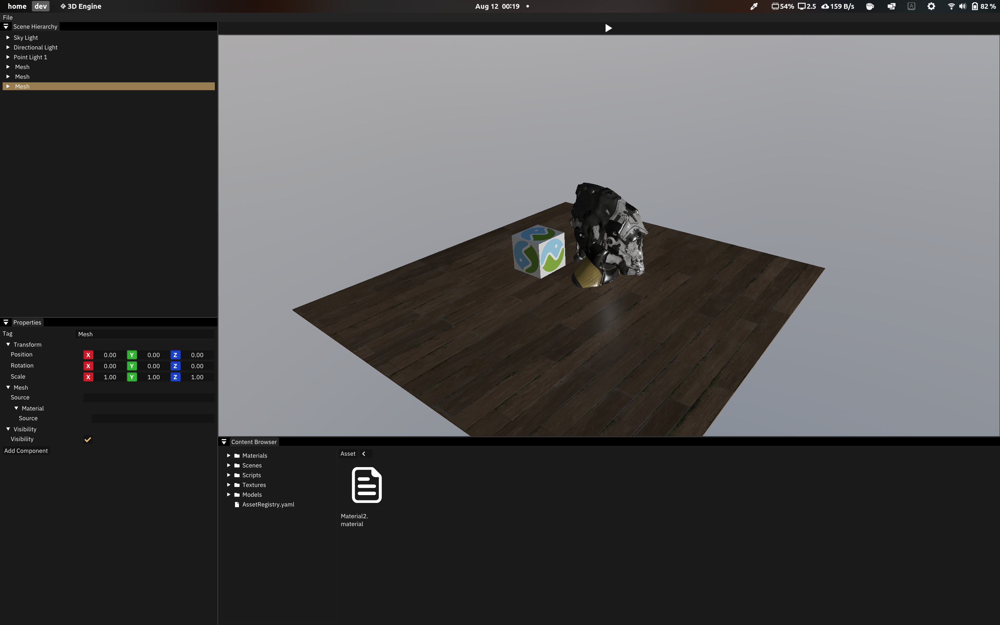

# 3D Game Engine

## My first attempt at making a 3D game engine using OpenGL and C++

I do not have a final name for the engine yet, and I'm currently working on the engine as an educational project, so I can learn more about graphics programming and game engine architecture. I have built most of the engine's systems using [Cherno's youtube series on game engine development](https://www.youtube.com/playlist?list=PLlrATfBNZ98dC-V-N3m0Go4deliWHPFwT), and I'm currently working on the renderer.

## Current Features

- Entity Component System
- 3D Model Loading
- Physically Based Rendering
- Lua Scripting (still in progress)
- Basic Physics
- Basic Collision Detection
- Editor (still in progress)

## Future Features

- Deferred Rendering
- Shadow Mapping
- C# Scripting
- Audio
- Networking
- Animation
- Particle System
- Terrain Generation
- Procedural Generation
- Visual Scripting
- Windows and Mac OS Support
- Vulkan Support

## Dependencies

- [GLFW](https://www.glfw.org/)
- [GLAD](https://glad.dav1d.de/)
- [GLM](https://glm.g-truc.net/0.9.9/index.html)
- [Dear ImGui](https://github.com/ocornut/imgui)
- [stb_image](https://github.com/nothings/stb/blob/master/stb_image.h)
- [Assimp](https://www.assimp.org/)
- [Lua](https://www.lua.org/)
- [Jolt Physics](https://github.com/jrouwe/JoltPhysics)

## Building

> Note: This project is only tested on Linux, and it will not work on Windows or Mac OS.

### Linux

1. Clone the repository using `git clone --recursive https://github.com/adl3879/3DEngine.git`
2. Generate the project files using `cmake -S . -B build`
3. Build the project using `cmake --build build`
